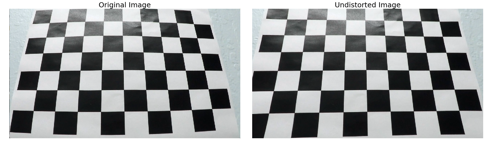
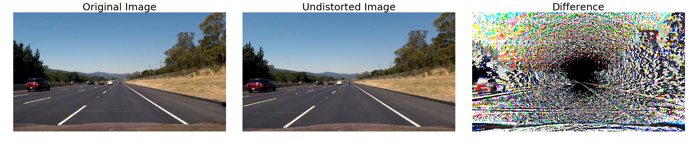
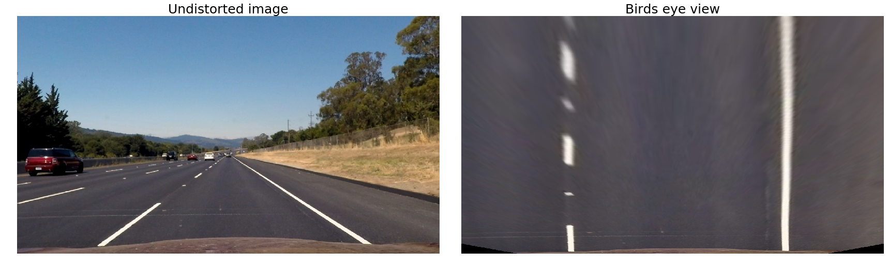
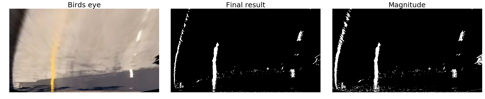
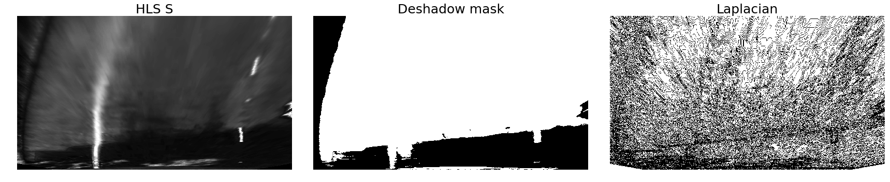
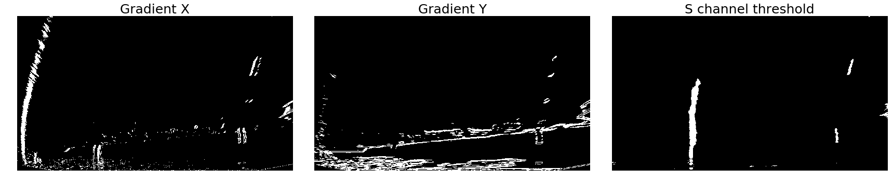
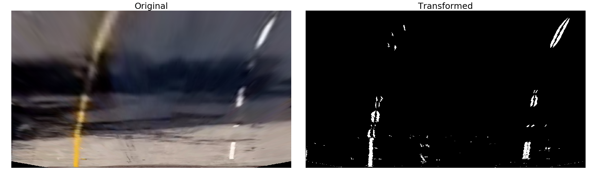
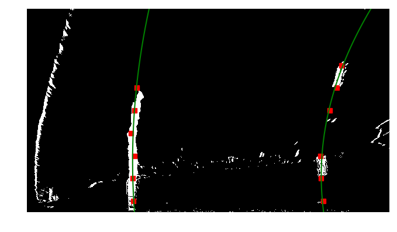
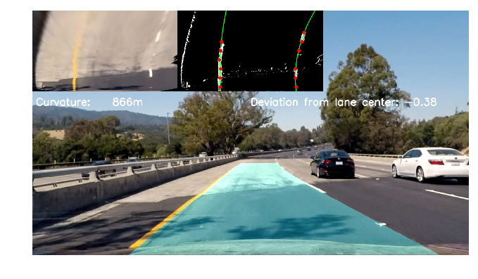
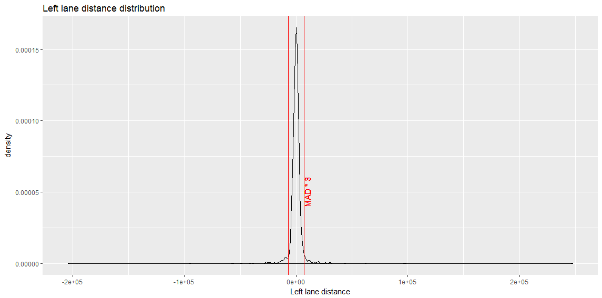

# **Advanced Lane Finding Project** 

---

 

The  steps of this project are the following:

* Compute the camera calibration matrix and distortion coefficients given a set of chessboard images.
* Apply a distortion correction to raw images.
* Use color transforms, gradients, etc., to create a thresholded binary image.
* Apply a perspective transform to rectify binary image ("birds-eye view").
* Detect lane pixels and fit to find the lane boundary.
* Determine the curvature of the lane and vehicle position with respect to center.
* Warp the detected lane boundaries back onto the original image.
* Output visual display of the lane boundaries and numerical estimation of lane curvature and vehicle position.

Final deliverable should be a program which converts a video file to version with marked inter-lanes area.

## 1. Camera Calibration
### 1.1 Calibration data 
Project files contains 20  pictures of a 9x6 chessboard located in directory *camera_cal*. These pictures will be searched for inside chessboard corners, which will be used as reference points to compute calibration parameters. 
### 1.2. Calibration algorithm
I use standard open CV function cv2.calibrateCamera - it requires 2 lists of positions of points: in real world and reference points on a image. I compute a position of corners in real world and store it in obp variable - this value is the same for all pictures, then for each picture I find corners and use them together with obp to calibrate camera. See below for an example of image undistorted using this algorithm.

Algorithm applied to one of test pictures:

## 2. Perspective transformation
 I used OpenCV **warpPerspective** to transform image to birds eye view. Perspective warping requires 4 source and 4 destination points to make transformation. I did a lot of experiments with points manually choosen from straight line images, but usually the upper ends of lanes became blurry. The best result was achieved using points found by [Alex Staravoitau](http://navoshta.com/detecting-road-features/). 
  
  In general this is the first example of parameters which make the whole project very sensitive - in case of choosing a little bit different points, the initial picture quality will be worse and this will populate through the whole analytic pipeline resulting in more errors. 
  
  An example of the transform is shown below:

## 3. Image thresholding

To experiment with various methods presented in lectures and their combinantions, I developed a functions to visualize :
* Laplacian 
* Gradient magnitude
* X and Y Sobel
* Gradient direction
* S channel thresholding
* HLS and HSV color spaces

During many iterations of trial and error, I tested different combinations of functions and their parameters. The final set contains sum (bitwise OR) of following functions:
* X Sobel with default kernel (3) and thresholds from 20 to 100
* Gradient magnitude with default kernel (3) and thresholds from 20 to 100
* HLS S channel thresholded from 170 to 255

Above information gives good representation of lanes, but is sensitive to shadows, therefore I thresholded main image removing colors belonging to shadows, then filter out this information from the final set using bitwise AND.

An example of analytic information from last iteration is shown below.

## 4. Processing pipeline

The main image processing does all steps described above in following order:
1. Undistort image
2. Convert to birds eye
3. Convert to gray and HLS
4. Calculate X gradient, gradient magnitude and dehadow mask
5. Combine all elements together - sum x gradient S channel threshold and gradient magnitude (bitwise OR) then apply deshadow mask using bitwise AND

In my code all above operations are done by the method **pipe** of the **FrameProcessor class**.

See an example below:

## 5. Lane finding and curve fitting

I decided to use convolution based method, wit modeification to avoid fonding centroids in empty spaces. For left and lright centroids, I used a threshold for convolution values to check if it shoudl be included in the centroid list. The resulting centrold list has variable length - instead for "empty" centroids, I do not store their values, because they disturb curve fitting.
An example of usage is shown below - we split the image into 9 layers, but for the right lane there are only 6 centroids (red squares) available. In my FrameProcessor class these operations are done within  the method **slide** of the **FrameProcessor class**.

## 6 Final picture

Final frame contains following elements:
 * inter-lanes area filled with transparent blue
 * curvature of the road calculated as  $R_{curve} = \dfrac{(1+(2Ay+B)^2)^{3/2}}{\lvert 2A \rvert}$ in my code this si done by the **curve** method of the **Line** class
 * deviation from lane center
 * mini debug windows in upper area of the screen:
  * Birdseye view
  * Centroids found and fitted lines

## 7. Sanity checks and smoothing

The lane finding algorithm is not perfect and sometimes it can not find good lanes, so the program should decide, if particular fitting is OK or not using the values found on the previous frame. In order to develop a model to find such outliers, I logged most of the fitted line parameters to a CSV file, then performed a short exploratory analysis.
Left and right lane detections have totally different characteristics, this is caused by different line styles - while left one is continous, the right one is dashed - in case of driving on the most right lane, the situation will be reversed. I decided to perform sanity checks independently for left and right lane - this will allow the program to keep good left line, and replace bad right one with previous version.

To determine if new line is good, I subtracted x values of last good fit, then used MAD (Median Absolute Deviation) to check for outliers.
An example of distance distribution for left and right lane is shown below.

In case of failure, the new line is discarded during maximum 8 frames. After 8 frames, algorithm will consider new line as valid.

If new line is classified as valid, it is added to list of good lines, then a mean value is calculated to have smooth transitions.

An example of movie is shown below, click on it for the full version.

## Conclusions

My model is very sensitive to the parameters - tuning them took me a lot of time and if I checked it on challenge videos, results were bad. If I devoted more time, I could probably change my algorithm to work with challenge video, but this exceeded my time budget for this project.

What I can suspect is that making a model, which will work on all possible road types and landscapes would require a lot of effort. In my case, the metod which worked best was to find trouble frames, save them to disk and tune the model to fit the new frames. To support challenge videos, more systematic approach should be chosen.

In case of business project, I would insist on having an automated test suite to simplify the testing process and allow for fast experiments. As an alternative, I would check Deep Learning mechanisms, but this was not subject of this project.
